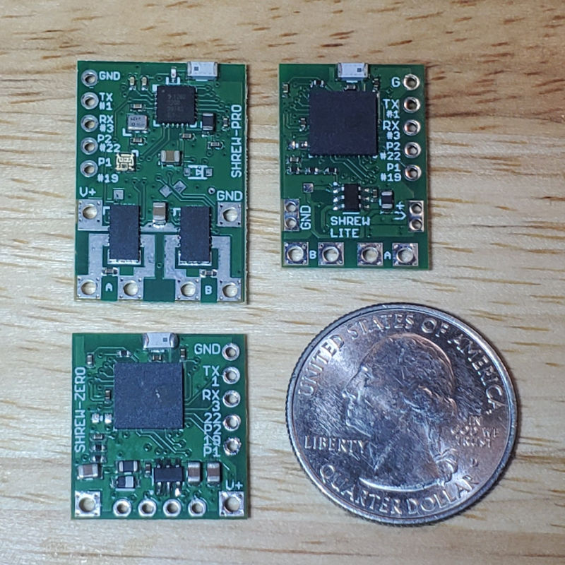

# Shrew: Dual Brushed ESC with ELRS

Shrew is family of ESCs (Electronic Speed Controller) that can drive two brushed motors, with an ELRS receiver integrated. It is designed to be as small as possible yet still pack plenty of power. It is meant for insect class combat robots.

There are three variations of Shrew

 * Shrew-Pro, for dual brushed motors up to 21A
 * Shrew-Lite, for dual brushed motors up to 3.7A
 * Shrew-Zero, not a ESC, just a receiver

All of these function as ELRS receivers with 4 or more GPIO pins, capable of controlling other ESCs or servos. These pins can output PWM, as well as better protocols such as Dshot. If you have the skills, you can even use them for I2C and such.

The input voltage ratings of Shrew is incredibly high, even Shrew-Lite can handle up to 36V, that means connecting directly to a 8S battery is not a problem (please see individual detailed specifications).

If you are using AM32 brushless ESCs with Shrew, Shrew features a webpage interface to configure the AM32 ESC. If you have 4 ESCs connected to Shrew, you can change settings on each one individually and test it immediately, all without disconnecting any wires. Plus, you can test the ESCs immediately after making a settings change through the same webpage interface.

## Design Ethos

Safety and reliability is on the top of my priority list

 * Digital protocols are safer than PWM ([why this is better](docs/Digital-Protocols-for-ESC-Control.md))
 * No-pulse failsafe mode by default ([why this is better](docs/No-Pulse-Failsafe-Mode.md))
 * No entering any unexpected modes, there is no way to accidentally enter some sort of calibration mode or binding mode
 * No dead-zone implemented, so there's no control lag at all, and there is also no need for calibration
 * Binding is done with a binding-phrase, extremely good for spare parts management of a competitive robot
 * Power input solder points are intentionally placed farther apart to prevent accidental short circuiting
 * RGB LED on it is indicative of control inputs, not just connection state

## Open Source Notes

All of the circuitry is designed using CadSoft EAGLE v7. This is NOT Autodesk EAGLE, but Autodesk EAGLE can open the files.

All the manufacturing data is tailored for JLCPCB's PCBA service.

The firmware in this repo are in binary form only, but the source code for them are on a branch of a fork of ExpressLRS: https://github.com/frank26080115/ExpressLRS/tree/shrew
