# Shrew-Zero User Manual

Shrew-Zero is a ExpressLRS RC radio receiver with 8 signal output, and a power input rated for 40V.

 * all outputs support multiple protocols: PWM (default), DSHOT300, PWM-stretched
 * all channels feature no-pulse failsafe set by default
 * serial port transmits CRSF protocol packets by default
 * all outputs can be used to configure and test AM32 brushless ESCs
 * power input is rated for 40V continuous operation, up to 60V voltage spikes

## Pin Map

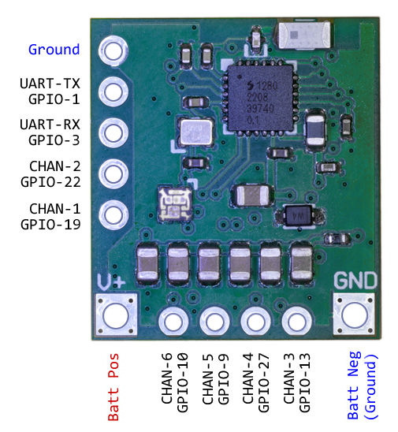

The `CHAN` number is the PWM channel number under default configuration. The `GPIO` numbers are the ones that can be used in the JSON configuration or in the firmware source code. The `UART`, aka serial port, can be remapped. A second serial port can be configured by the user. Note that the UART pins can be used for additional PWM/DSHOT pins if you want 8 channels instead of 6 channels.

## Dimensions

20mm x 18mm

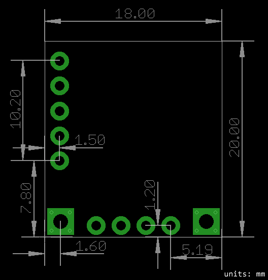

## LED Blink Meaning

| Behaviour | Meaning |
|-----------|---------|
| 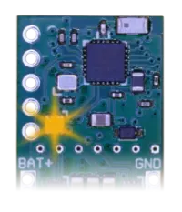 | not connected, waiting for connection   orange regular blink |
|  | not bound, please bind it to a transmitter   orange double blink |
| 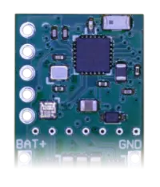 | Wi-Fi mode   green yellow green animation |
| 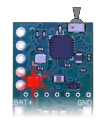 | connected and active   solid colour, colour changes as the radio transmitter sticks/channels move |

(above table contains animations, appologies if they are not playing correctly)

## Transmitter Preperation

Just in case you need it, here are some links to official ExpressLRS instructions on how to prepare your transmitter:

 * [Radio Preperation](https://www.expresslrs.org/quick-start/transmitters/tx-prep/)
 * [Lua Script Install](https://www.expresslrs.org/quick-start/transmitters/lua-howto/)

**Important Note:** Your transmitter can run official ExpressLRS firmware, as long as it is version `3.3.0` and later. **You can use ExpressLRS Configurator to update your transmitter**

**Important Note Continued:** The Shrew firmware is not official ExpressLRS firmware, and does not have to match to the transmitter firmware. **Do not use the ExpressLRS Configurator to update Shrew-Zero**.

I hope you have followed the instructions above and have access to the ExpressLRS Lua script on your transmitter. Run the `ExpressLRS` script, scroll down and select `WiFi Connectivity`, and then select `Enable WiFi`.

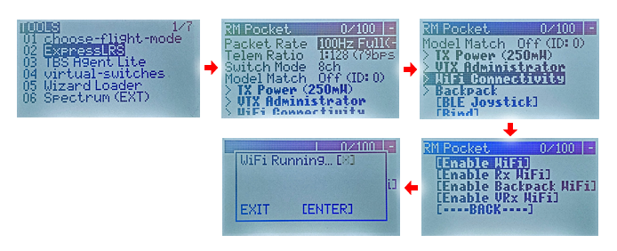

From your phone or computer, connect to the `ExpressLRS TX` Wi-Fi access point. The password is `expresslrs`.

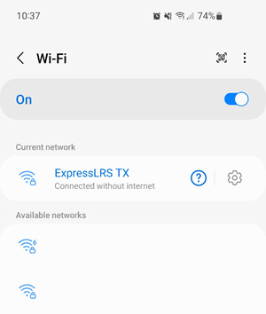

Use your web-browser to navigate to `http://10.0.0.1/`

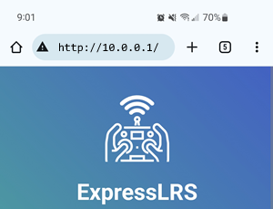

Scroll down and edit the binding-phrase and then save it.

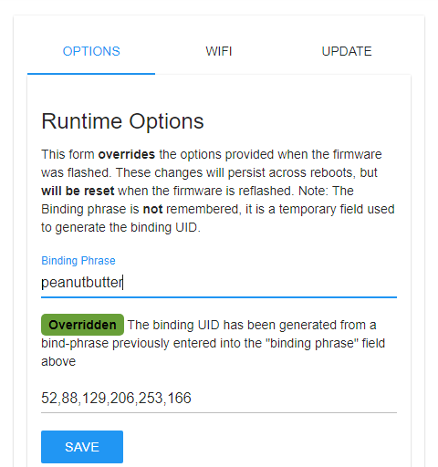

Once you have saved it, **turn off the radio**, or at least exit Wi-Fi mode.

## First Time Binding

Connect the Shrew to a power source. Shrew is designed to be directly connected to a battery, no pre-conditioning (such as a BEC) is required. The LED should start blinking orange. Wait for about 60 seconds. Then the LED will start to go crazy (it's like a green-yellow fading animation). This means the Shrew has activated its own Wi-Fi access point.

Using your phone or computer, connect to the `ExpressLRS RX` Wi-Fi access point. The password is `expresslrs`.

Use your web-browser to navigate to `http://10.0.0.1/`

Scroll down and edit the binding-phrase and then save it.

Once you have done that, Shrew should be ready to use with default settings.

**IMPORTANT:** The Shrew firmware disables the activation of binding mode by power cycling it 3 times. This is done to prevent accidental activation of binding mode.

## Please Set Packet-Rate

ExpressLRS is originally intended for racing drones with high responsiveness, but that means your transmitter is likely set to a super high packet-rate. The high packet-rate setting does not send all of the channels. We need to change the packet-rate to something lower that sends all of the channels.

Use the `ExpressLRS` Lua script again, set the `Packet Rate` option to `100Hz Full`. Then set the `Switch Mode` to `16ch Rate/2`.

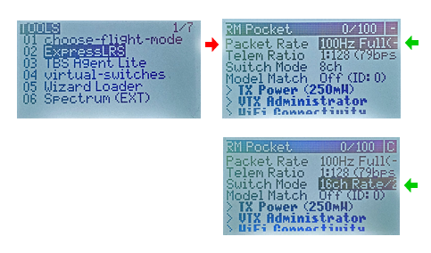

For a full explanation, ExpressLRS officially has this documentation: https://www.expresslrs.org/software/switch-config/ . Only the 100Hz and 333Hz modes support full resolution channels, and only the rate/2 mode allows channel 5 to work normally.

If you want the best possible performance, read the section on `Packet Rate Lock` later on.

## First Test

Have your radio transmitter powered up and ready to use. Power-cycle Shrew-Zero, it should connect to your transmitter, the LED should stay a solid colour, and your transmitter should indicate that it is connected (you might see a RSSI symbol somewhere on your screen).

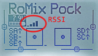

Moving any sticks/channels on the transmitter should make the LED on the Shrew change colour. (experimental feature, ExpressLRS receivers don't typically do this, but Shrew firmware does)

## Activating Wi-Fi

To configure anything on Shrew-Zero, you need to connect to its web-ui via Wi-Fi. There are two ways of activating Wi-Fi on Shrew-Zero.

 * Powering it up without a transmitter, and then waiting for 60 seconds. (this time period is configurable)
 * Powering it up, connect it to the transmitter, and then using the transmitter's Lua script to activate Wi-Fi. This is similar to activating the transmitter's own Wi-Fi, but you use the `[Enable Rx WiFi]` option instead.

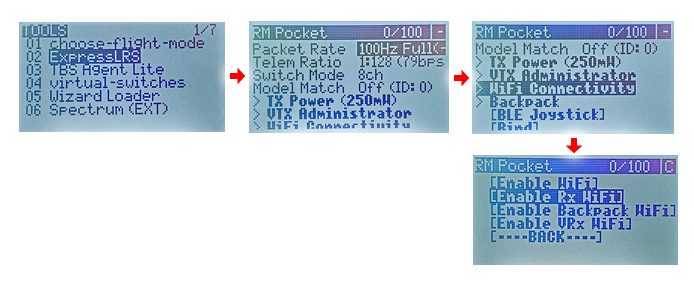

From your phone or computer, connect to the `ExpressLRS TX` Wi-Fi access point. The password is `expresslrs`.

Use your web-browser to navigate to `http://10.0.0.1/`

## Editing the Channels

Once you are on the Wi-Fi web-ui page, you should see a table like this:

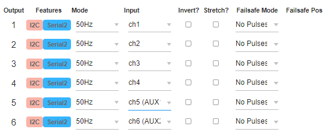

If you are using a ESC that supports DShot protocol (specifically DSHOT300), it is recommended that you change the `Mode` drop-down to `DShot`. Otherwise, use `50Hz` mode for servos and ESCs that do not support DShot. Ignore the other modes for now.

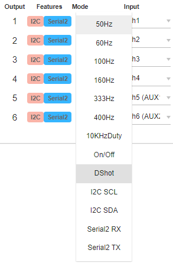

To rearrange the channel mapping, use the `Input` drop-down to select the radio channel that the output should be mapped to.

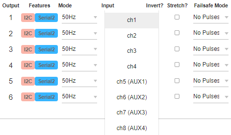

The servo-stretching feature can be activated by checking the `Stretch?` checkbox. Servo stretching means that the sent PWM pulse width is from 476us to 2524us instead of 988us to 2012us. This is useful for wide range servos.

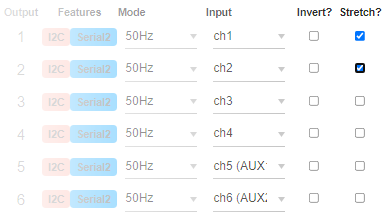

The failsafe mode should be left at `No Pulse`, this is the safest option. (other options are explained)

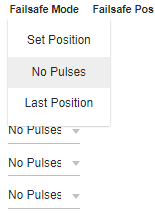

## Other Notable Options

#### Packet Rate Lock

I recommend you activate this option:

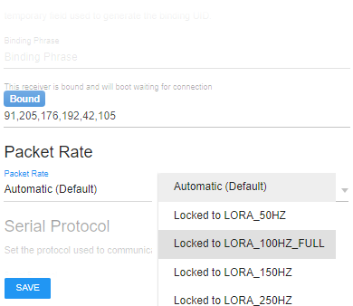

In the previous steps, I have asked you to set the packet-rate to 100Hz already. Locking it on Shrew will allow for it to reconnect a bit faster.

#### AM32 Configurator

While connected to the Wi-Fi web-ui, use the web browser to visit `http://10.0.0.1/am32.html`

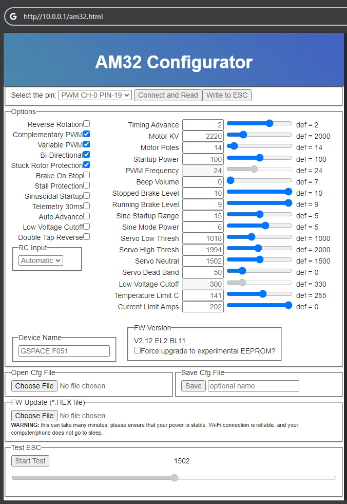

#### More Advanced Usage

ExpressLRS is open source, and the source code for Shrew is a fork of the ExpressLRS source code. If you wish to add your own features to Shrew's source code, the starting point is at [https://github.com/frank26080115/ExpressLRS/tree/shrew](https://github.com/frank26080115/ExpressLRS/tree/shrew).

The GPIOs are capable of things like I2C, an extra serial port, or even CAN bus.

## Firmware Update

If there is a firmware update, it must be obtained from [https://expresslrsconfig.eleccelerator.com/](https://expresslrsconfig.eleccelerator.com/), which is my firmware distribution mechanism for Shrew. **Official ExpressLRS firmware will not work for Shrew. Do not attempt to obtain a firmware using the official ExpressLRS GitHub repo or their configurator.**

Be sure to select `Shrew-Zero` as the receiver!

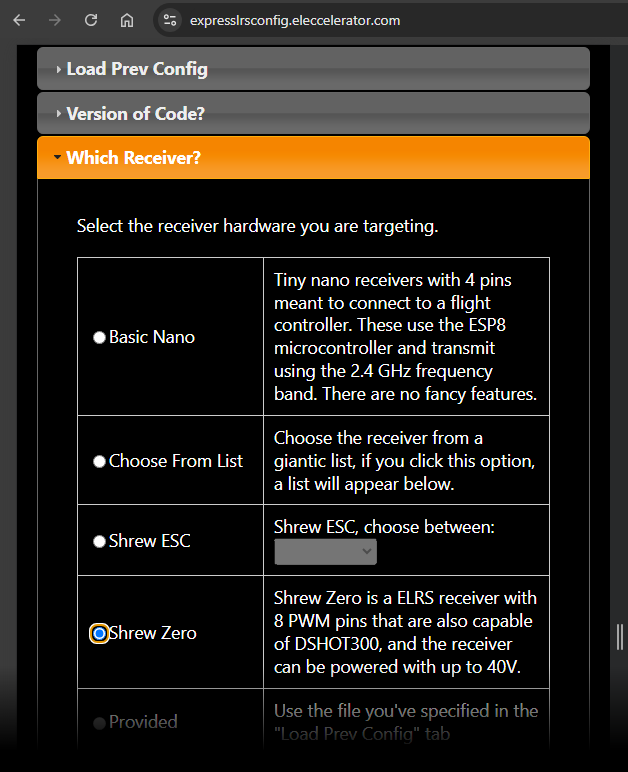

Go ahead and configure the firmware however you like, just make sure the receiver is `Shrew Zero`. After you are ready, click on `Save for Wi-Fi Install`.

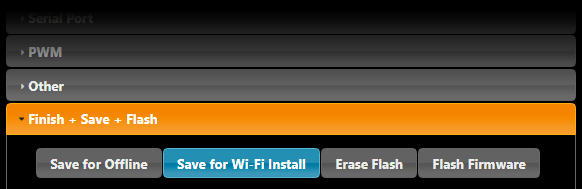

Once the firmware `*.bin` file has been downloaded, it can be uploaded to the `Update` tab in the Wi-Fi web-ui.

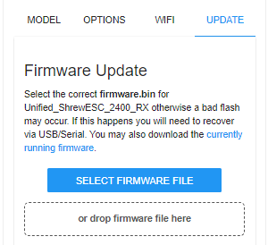

**IMPORTANT:** Updating the firmware in any way will reset all settings to the default as specified in the firmware. Please double check your settings after every firmware update.

If you need to update the firmware via a USB-to-serial converter, then follow the instructions on [firmware updating via USB](docs/Firmware-Updating-via-USB.md). (for example, if Wi-Fi is unavailable due to corrupted firmware, or, if you are building the circuit at home instead of purchasing one)

## Wiring Hints

Shrew-Zero is meant to allow the user total freedom in how they want to wire it. I expect most users to solder wires directly to it.

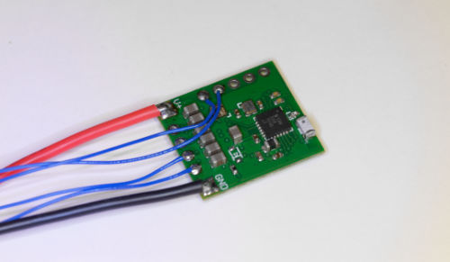

The wires can be pretty thin, the signal wires require almost no current at all, the power wires need to handle 80mA normally, and 300mA at maximum.

If you want to add pins, here are some suggested ways:

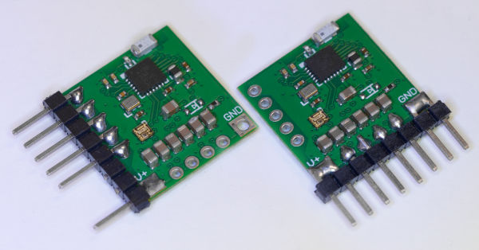

Notice that I did not use bent headers, I used straight headers, and the legs **did not** go into the holes. This is intentional and it is the way I am recommending you solder on pins. As long as you put enough solder to reach the other side of the board, joints like this is more than strong enough.

Recommended heat-shrink wrap size is 3/4"

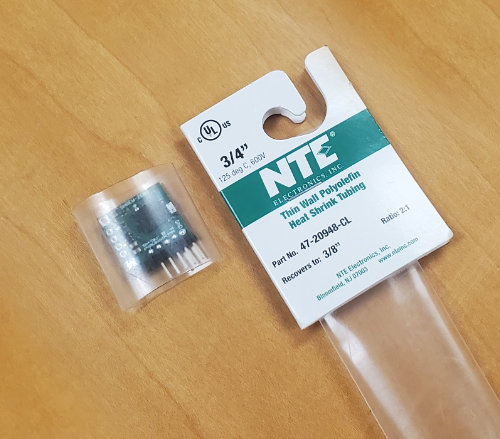

If you want to learn how to make super short connectors, [check out this guide](docs/Make-Short-Dupont-Plug-Connectors/readme.md)

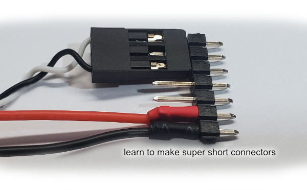

## Appendix

 * [Reassigning Pins](docs/Reassigning-Pins.md)
 * [Digital Protocols for ESC Control](docs/Digital-Protocols-for-ESC-Control.md), and why they are better
 * [No-Pulse Failsafe Mode](docs/No-Pulse-Failsafe-Mode.md), and why it's safer
