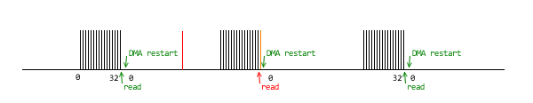
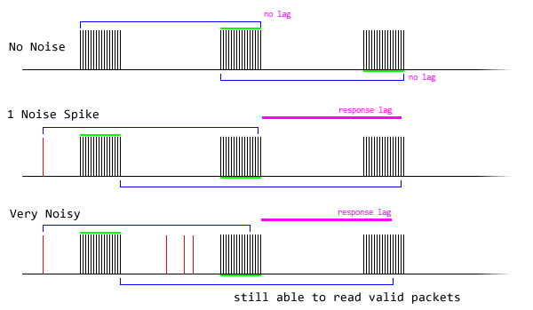

# AM32 with Robust Dshot

## What is Dshot

Dshot is a digital communication protocol used in RC hobbies, most prominently in drones, for a flight controller to tell a speed controller how fast to spin. It's way better than any of the usual PWM methods, it's quick to send, it's precise because it's digital, and it's safe because it's protected by a CRC.

Dshot is better than CRSF because each ESC can be individually configured. If a bunch of ESCs are using CRSF, you need to disconnect a ESC every time you want to reconfigure it. With Dshot, you just leave them all connected and you can still reconfigure all of the ESCs.

## The Issue

This is written on May 5 2025. There's a chance that the issue below has been addressed, especially since I've brought the issue and solution to light.

When Dshot is used in a high noise environment, AM32's method of receiving Dshot packets has a chance of getting in a state when it rejects a ton of packets. Let me explain...

AM32 receives Dshot by measuring 16 pulses, which is 32 signal edges. When the DMA receives 32 timestamps from the input-capture-timer, it executes the evaluation function, then the DMA is reset back to 0.

So what happens when there's a noise spike?

The above diagram is how the main developer of AM32 told me what would happen.

Notice how the time it takes to "read" is longer than the time for one pulse?

The reading function does take some time to execute, it has to calculate if each pulse is a 1 or 0, and then do a CRC calculation.

So in the event of a singular noise spike, everything should work fine but we lose one packet, the next packet is still fine. In fact, if this is true, then even if we have more than one noise event, it might reject one or two packets, but it will **eventually recover** to a normal state again.

Or... so we thought...

The code also does something else clever. It measures the time between the first pulse and last pulse, and if it's too long or too short, it rejects the packet.

This is quick, great, being quick does mean higher possible RPMs for the motor. BUT it means the reading function is extremely fast when it detects an error. It only does one subtraction operation, instead of all the iteration and CRC stuff.

We then end up with missing consecutive packets even though we only had one noise spike.

I've experienced this both on the bench tests and also during a robot fight when the two robots did a weapon-on-weapon hit. My robot ended up with a unresponsive weapon after that event, it was getting a signal, there's a way to tell, but it wasn't getting a valid signal.

## My Solution

Instead of having the DMA count to 32, I'm using it's half-way feature and it's circular buffer feature. I can tell it to count to 64, but also run a event when the count gets to 32. Also, if it goes over 64, the DMA automatically resets to 0 and continues recording (instead of relying on some code to finish first and then being reset manually).

Now I have 64 signal edges remembered, so 32 pulses, which is 2 packets of Dshot. My algorithm scans, from the latest pulse, backwards, looking for a complete and valid Dshot packet.

It is guaranteed to find at least one packet that's valid. In a noiseless scenario, it will be memorizing 2 completely valid packets but only evaluate the latest one.

I pointed out a flaw in this, which is that noise will cause a slight lag. For combat robotics, this lag is negligible. For racing drones? I'm not sure. There's a few solutions to remove the lag but they are kind of complicated. Such fixes will require people with more experience around drones and plenty of real world testing.

## Availability

Before you start, obviously you need to be using something that sends Dshot. If you are using Shrew, you already have it. [If you are using a RadioMaster XR2, then you need my special firmware that gives it Dshot capability (click here)](../RM-XR2-PWM-Mod/readme.md).

I have [a few builds of AM32](builds) for a few ESCs that are popular in combat robotics (click on the link). The name of the files indicate what actual AM32 version the build is based on.

The source code for the code modification, is on a branch, of my fork, my fork of AM32. It is here: https://github.com/frank26080115/AM32/tree/fix-dshot-reliability-20250520
