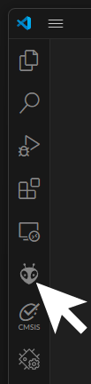

# Shrew Firmware Build Setup

To start developing customized firmwares for Shrew, you need to have the build tools used by the ExpressLRS project first, then obtain a copy of the Shrew firmware fork of the ExpressLRS firmware project.

ExpressLRS firmware is built using Visual Studio Code and PlatformIO (which uses the official ESP32 toolchain and Espressif Arduino framework internally)

## 1. Install Visual Studio Code

Go to https://code.visualstudio.com/ to download Visual Studio Code. Then install it.

## 2. Install PlatformIO

Open Visual Studio Code. On the side tool-bar, open the extensions manager. Use the search box to search for `PlatformIO IDE` and then install it.

Alternatively, there is also instructions on how to install PlatformIO on the PlatformIO website: https://platformio.org/install/ide?install=vscode

## 3. Setup GitHub

If you don't have a GitHub account, you should make a GitHub account. Log into your GitHub account.

Visit https://github.com/frank26080115/ExpressLRS/ (the most important thing here is that it's the fork of ExpressLRS but from my account, frank26080115's account)

Click on the `fork` button to make a fork into your own account.

If do not understand how to use Git, then I recommend you install GitHub Desktop first: https://desktop.github.com/download/

Once you have git or GitHub Desktop installed, visit your own fork of the repository, and then make a clone of it on your computer.

For the sake of an example, pretend you have cloned the repo into `C:\ExpressLRS`

## 4. Opening the Right Branch

Using GitHub Desktop, select the `ExpressLRS` repository, and then use the branch selector, select the `shrew` branch.

If the `shrew` branch is somehow not available, it means you did not perform the fork from the proper git repository, or you have multiple `ExpressLRS` projects and picked the wrong one with GitHub Desktop.

## 5. Opening the Project

Run Visual Studio Code. Use the menu to `open folder`. You need to open the `C:\ExpressLRS\src` directory.

## 6. Perform a Build

In the Visual Studio Code window, look on the side tool-bar, click on the PlatformIO icon

Expand the task that starts with `Unified_Shrew` and ends in `_UART`

This might take a while if this is a new PlatformIO installation, it will install the required tools to perform the build. After that you should see an option to do builds and uploads.

(if the `Unified_Shrew` option does not exist in the list of tasks, it means you are not using the right branch)

