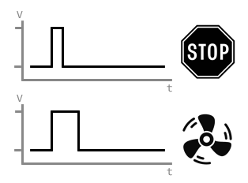
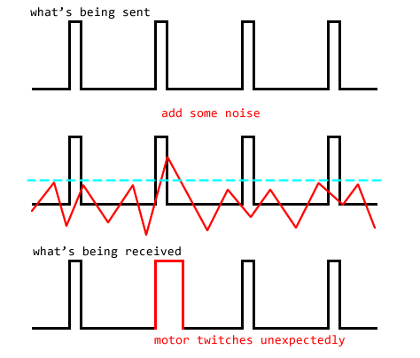
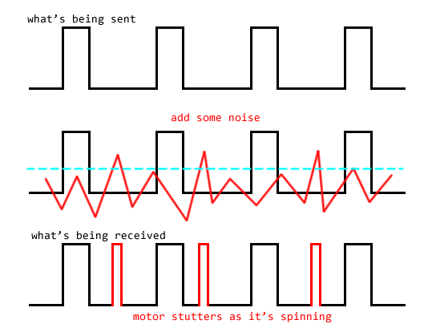
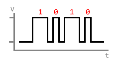
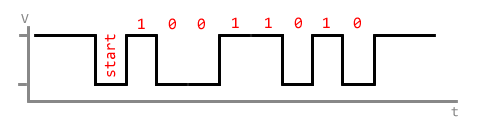
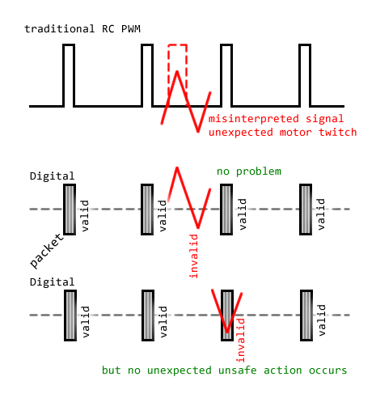

# Digital Protocols for ESC Control

## Understanding PWM

Traditionally, RC radios sent control signals as pulses. A long pulse tells a motor to speed up, while a shorter pulse tells the motor to slow down or stop.

This is called Pulse Width Modulation, or PWM. This was the standard because the RC radio hobby is older than computers, and this was the easiest, cheapest way.

But this type of signaling has many disadvantages. It is an analog form of communication, not digital. The device generating the pulse might have wanted to generate a pulse that's 1.234 milliseconds long, but because of non-idealities of the real world such as temperature and stray capacitance, it might've generated a pulse that's actually 1.235753 milliseconds long. The device reading that pulse is also subject to non-idealities, and read the pulse as 1.237598 milliseconds.

This isn't such a big deal since we have techniques such as trimming, and it is also why almost all ESCs have a calibration function. But these methods do not solve the problem of having noise in the PWM signal.

Below is a simple diagram to illustrate how some noise can cause a motor to unintentionally start spinning, which is a safety concern.

Next, this scenario will make a motor to stutter while it is spinning.

The motor ESC that's reading the PWM signal cannot really distinguish between what is noise and what is a true signal.

## Digital Signals

When a signal is called digital, it means that the information is being sent as **discrete** symbols. When the transmitter sends 123, the receiver receives exactly 123. In that example, the number 123 is encoded as a series of binary bits, ones and zeros, 1 and 0.

These binary bits are still being sent as electrical pulses.

The Dshot protocol sends the 1 bit as a long pulse and the 0 bit as a short pulse. The difference between a long pulse and a short pulse in this context is quite large so it is extremely difficult to confuse between a 1 and 0.

The CRSF protocol is following a standard serial port encoding. 1 is sent as a high voltage and a 0 is sent as a low voltage. The bits are sent in series, each bit taking the same time no matter what. The receiver has to simply read the voltage at regular time intervals. The first bit is always 0, and the last bit is always 1, and the number of bits is always 8. This way, the receiver knows when to start reading.

## Data Integrity Checks

While digital protocols are very resistant to things like temperature changes, they are not immune to noise. Depending on the strength of the noise, a 0 can be turned into a 1.

Digital protocols like DShot and CRSF feature a data integrity check, implemented as a CRC (cyclic redundancy check) checksum. Data integrety checks are what's used to ensure a packet of data, or a file, is not corrupted. The checksum bits are sent after the data bits, and represents a mathematical calculation that can prove the data bits have not been corrupted.

For example, let's pretend to use a protocol that sends 4 numbers and uses 1 number as a simple checksum that sums up all four numbers. We send `34, 57, 19, 24` as the data, 34 + 57 + 19 + 24 = 134, so the final packet looks like `34, 57, 19, 24, 134`. But if because of noise, the 57 is corrupted into 58, then the receiver reads a packet that looks like `34, 58, 19, 24, 134`. The receiver performs a checksum calculation 34 + 58 + 19 + 24 = 135, since 135 is not 134, the receiver knows that the packet is corrupted, and it is ignored.

NOTE: the CRC checksum algorithm is a bit more complicated than just addition.

The data integrity check feature is extremely good for safety and reliability. The diagrams below shows what happens if the noise occurs between packets, or even during a packet.

If the noise happens when no packet is being sent, the noise does not look like a packet with a correct checksum, so nothing bad happens. If the noise occurs right in the middle of a packet, the packet is also simply rejected, due to a bad checksum, instead of causing the motor to behave unexpectedly.

As a reminder, if the noise happens to a PWM signal, it might appear as a longer PWM signal than what it should be, causing a motor to spin up unexpectedly.

Therefore, it is much safer to use a digital protocol that has a data integrity check, such as DShot or CRSF.

## The Relevant Protocols

The most relevant digital protocols for us are: DShot, CRSF, and SBUS. These are used in RC hobbies such as multicopters. Shrew is here to also use these protocols for RC hobby robotics.

### Dshot

DShot is used to control a single ESC. When hobby multicopter microcontrollers (flight controllers, aka FC) became more capable, DShot was invented to provide more precise and more reliable control of brushless motor ESCs.

On Shrew, all pins can be configured to use DSHOT300, where the 300 indicates the bit-rate. This protocol is accepted by all BLHeli_S, BLHeli_32, and AM32 firmware ESCs.

There are no extra configuration needed on the ESCs to use DShot, it should be automatically detected.

Because each DShot signal only connects to one ESC, when Shrew is connected to multiple ESCs with DShot, each ESC can be individually configured through the web-ui. When using Shrew, DShot is the recommended method of connecting to ESCs.

### CRSF

CRSF is a protocol used to communicate between a RC radio receiver and a flight controller, the flight controller is expected to take data from a CRSF packet, and then split it to DShot packets for the four ESCs typically used in a quadcopter. But today, ESCs running AM32 can decode CRSF directly instead of requiring a flight controller.

(NOTE: only the cutting edge experimental AM32 firmware can decode CRSF right now, the official regular AM32 firmware cannot, we are all waiting for the experimental features to be added to the official features. It is easy to upgrade older AM32 firmware to the newer experimental firmware)

A CRSF control packet can carry multiple channels of data at once. This means one output pin on the receiver can control multiple ESCs at once. This requires each ESC to be configured to use CRSF and also configured to know which sub-portion of the whole CRSF packet it should be reading.

Shrew sends CRSF out the UART-TX pin by default. This pin can be reassigned as a PWM or DShot pin if you don't need it.

Because while using CRSF, all the ESCs have to use a single pin, the ESCs **cannot** be configured at all while connected to the receiver.

### SBUS

SBUS is similar to CRSF, it is the standard used by FrSky brand products. ESCs running the latest BLHeli_32 firmware can decode SBUS. FrSky intentionally made SBUS difficult to use by DIY electronics hobbyists, in order to drive more sales of their own products. Hence it is not as popular.

Shrew is capable of sending SBUS. The protocol needs to be reconfigured from CRSF to SBUS through the web-ui. The baud rate also needs to be changed to 100000.
