Shrew, even though it’s mostly just a receiver, is still capable of transmitting wirelessly. So in the eyes of the FCC, it is an “intentional radiator”. Shrew is also designed to be as small as possible, so I didn’t use any pre-certified modules.

I did spend many hours trying to find any loop holes I can to avoid having to put Shrew through FCC certification, and found none. Through my research, it seems like the estimated cost is going to be under $10000, with some sources claiming as low as $4000. This is expensive but it’s within the realm of affordability for a home business. This is a lot of NRE cost, but Shrew is still a hobby project, I simply want to see it succeed, and see it help other people succeed, profit is secondary. I never planned on getting rich quick on a stamp sized circuit board.

I also emailed around some people I know in the DIY electronics industry, asking if anybody know of any exemptions or sponsorships for open source hardware projects. I think it would be cool if there was a volunteer group that will validate that a particular project meets the requirements to be called “open source”, and then either be able to subsidize the FCC certification testing costs, or even operate a lab.

I actually have very high respect for the FCC, I appreciate everything they do and I understand why they have all these rules. I do have a ham radio license, which is when I became familiar with the FCC. On a similar note, I respect the FAA in the same way, without the FAA, I’d die of anxiety, but with the FAA, I can fall asleep as soon as I find my seat and wake up right when I land.

At this point I’ve made peace with Shrew having to go through certification. I’ve read through the entire FCC Part 15 document.

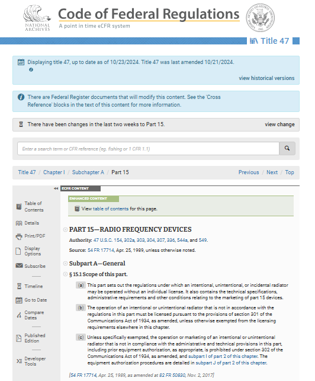

I marked down all the classifications that Shrew meets, noted which items were relevant or irrelevant, and tried to find any items that would cause Shrew to fail. There were many items that I had to note as “ask the lab” and “to be measured by lab”. 

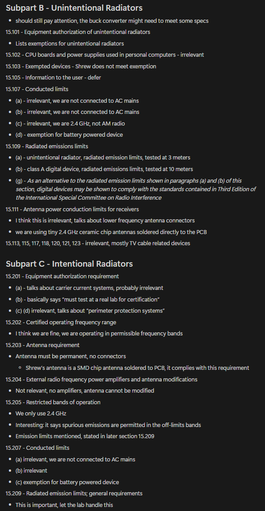

One of the most important things I noticed is that Shrew skips a lot of items simply because it is battery powered instead of wall powered. This saves me a ton of money, there won’t be any conducted interference tests.

To get a better idea of what tests Shrew will need to pass, I wanted to see examples of FCC ID filings, which are publicly available. By luck I owned a RadioMaster ER4 receiver and it had a big fat FCC sticker on it.

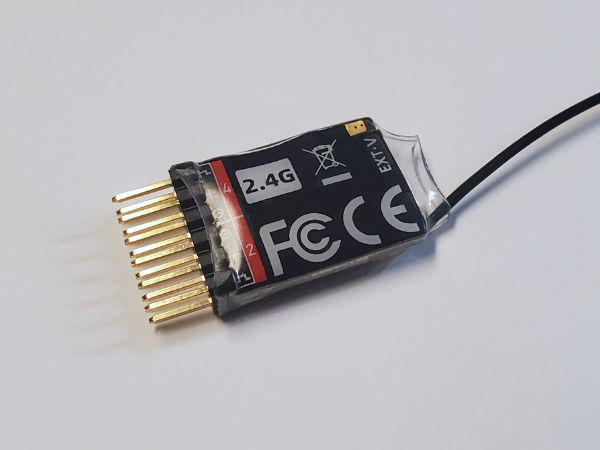

So I did a search for the company name “RadioMaster” in the FCC ID database and found a ton of their products (they seem to have many different company names so it's not all found in one group). While there might be products that are not in the list of filings, if you actually read the report, you can see statements such as

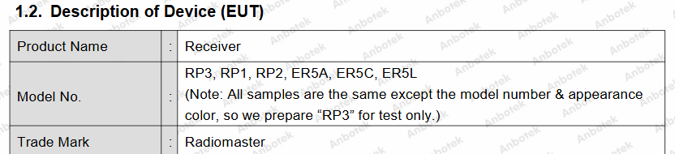

The FCC filing for the ER8 is available here: https://fccid.io/2BBP3-ER8 , the ER8 is extremely similar to my own design, as it uses a ESP32 instead of a ESP8.

The usage of one FCC ID for multiple products is allowed if they are similar enough and the proper paperwork is done. The FCC are not jerks.

I read through every single test, and made sure that Shrew can perform all of the tests listed. What I definitely noticed is that RadioMaster had Bluetooth tested, but I don’t remember any Bluetooth functionality in ExpressLRS firmware. All my research suggests that it wouldn’t be necessary to test Bluetooth if the product doesn’t use Bluetooth, even though the microcontroller is capable of it. I think RadioMaster is simply just a user of open source projects like EdgeTX and ExpressLRS, without having a strong engineering team, so the testing lab just lumped in the Bluetooth test as soon as they saw that the products used a Espressif ESP chip.

I also noted that RadioMaster used a certification lab based in Shenzhen China, which I can consider because their website clearly said that they can handle international clients. But I do want to use a domestic American lab because it would be more convenient and less risky, as long as it is affordable.

After seeing all the testing done on the ER8, I made some comparisons with Shrew. On the surface from just reading the output power levels of the SX1280 and the ESP32, it's not very physically possible for the Shrew to output more RF energy than what is allowed. The Shrew has a much better Wi-Fi antenna than the ER8 though, and what’s extra concerning is that both the Shrew and ER8 don’t implement any filtering on the Wi-Fi feedline at all. This is risky for emitting high frequency harmonics, which is one of the items being tested. To mitigate this risk, I edited the Shrew circuit to include a capacitor on the Wi-Fi feedline that should pass high frequency components right into the ground plane.

I actually own a RF Explorer, which is a handheld spectrum analyzer. Don’t let its small black-and-white screen fool you, its PC software is very good for something at this price point (there's a USB port on the device). It's constructed out of metal and feels very heavy and beefy. Plus, I’ve communicated with its maker many times and I’ve enjoyed all of my conversations with him.

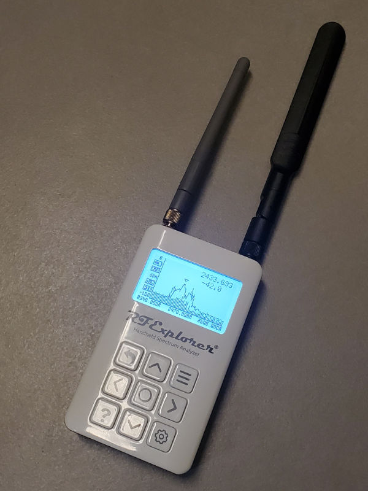
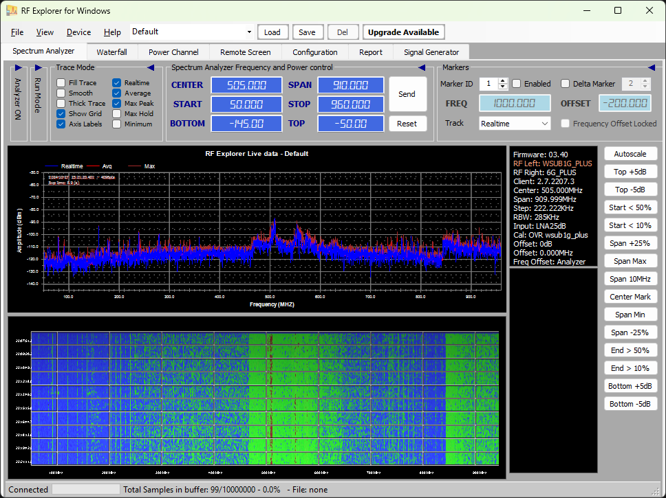

With this spectrum analyzer, I can use it to confirm things such as bandwidth, channel overlap, frequency separation. Plus, there’s actually a dedicated RF Explorer antenna kit that can be purchased, and it comes with calibration data-table for the antennas, which allows the RF Explorer to actually be used for EMC testing. Plus, if you stay under the RF Explorer's maximum input power limits, you can use it as a power meter too (Shrew maxes out at +19.5 dBm and the RF Explorer can handle +30 dBm).

I tried to do a EMC test at my desk. I actually started with a old prototype of Shrew, one that used a LDO linear voltage regulator. The spectrum analyzer showed that there were spikes starting at 336 MHz and then spikes evenly spaced at 48 MHz, up to about 720 MHz. I then switch to the recent Shrew prototype with the buck converter, which I expected to perform worse because obviously the buck converter will be switching at 2MHz. Surprisingly, it performed better, I only saw spikes at 240 MHz, 480 MHz, and 720 MHz. 240 MHz makes sense because the ESP32’s clock is 240 MHz, 48 MHz is the base clock before the PLL. So I wondered why the buck converter version of Shrew did not show the 48 Mhz harmonics.

TODO: insert screenshots of spectrum analyzer

I chit chatted with some people online about this strange finding, and basically came to the conclusion that the difference was made by the extra bit of capacitance on the 3.3V power rail since the buck converter requires a big capacitor after the inductor. With this new realization, I found some blank space on the Shrew PCB design and edited in a couple more small capacitors, just to be safe. These components are less than a penny in cost, and de-risks Shrew failing the EMC test, since Shrew is a bare circuit board without any housing or shielding, it is at a disadvantage in this regard.

With these two small PCB changes, I ordered another batch of prototypes to be build. These will be the ones that go to the lab for testing. For this particular build I specified to use a dedicated BOM filled with the best of the best capacitors, low ESR and high stability. Surprisingly, they are not that much more expensive.

TODO: insert screenshots of PCB changes, point out the capacitors

Using better capacitors just for testing might sound like cheating, but it’s actually a common practice. Since the lab isn’t responsible for changes to the product later at all, they don’t really care. If the new product have crappy enough capacitors to cause problems, the manufacture is the one violating FCC requirements, not the lab. After I get my results, if I’m passing but only barely, then I keep the new BOM as the production BOM. If I’m passing the test with flying colours, I can easily try the test again at home with a cheaper BOM as a double check.

The Wi-Fi tests will be done with the ESP32’s dedicated testing tool, which is provided by Espressif.

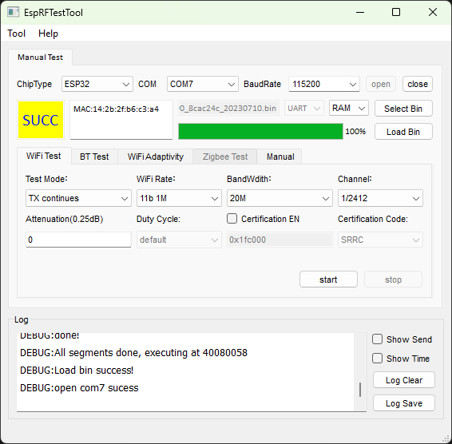

I gave it a shot at home, it works, I can clearly see the signal on my spectrum analyzer. The current consumption is extremely high, like over 400 mA from my DC bench supply, the buck converter is only rated 600mA but it seems to be surviving. Interestingly… I don’t see any clock frequency harmonics… I think the test firmware sleeps the CPU?! I asked around the ESP32 community about this and basically people just say the firmware is a black box, nobody knows what it actually does. Importantly, the labs are all using this software and it’s not a problem.

For testing the SX1280 LoRa radio, I’m going to have to write my own firmware. I got lazy, since I didn’t want to reimplement a HAL for the SX1280, I just wrote a testing serial console into ExpressLRS. It just parses text input to execute functions. All of the functions I needed, including the tone test, was already in ExpressLRS so this was easy. Using the serial port with the terminal means I don’t have to develop a GUI.

I was actually procrastinating getting a quotation from the certification lab I wanted to use, but the existence of Shrew got leaked to Peter, who I wanted to work with anyways, and he wanted some samples. I sent him the samples and finally contacted the certification lab.

In the first email I briefly explained what the circuit is, that I wanted a FCC ID for it, and made it clear that it had two radios and was powered by user supplied battery. In their reply I was asked to provide: photos, hardware specifications (very broad request), if I am using any pre-certified modules, datasheet for the antenna (and any amplifiers). Most of these items are easy to provide, for the hardware specifications I included the entire schematic diagram, plus all the voltage ratings, and literally every single item I found in the FCC filing for the RadioMaster ER8. After I sent that, I was asked to clarify if I wanted the Wi-Fi tested as DTS or FHSS, either is acceptable and only one is needed, and I replied that I wanted the DTS test because that’s what the ER8 did. Then I got the quote, which had a nice breakdown of the tasks and what each task costs, plus the clarification on the additional lab time cost per hour in case a test needs to be re-done.

TODO: insert document here

This is insane! But keep in mind, this is a lab in the heart of Silicon Valley. The lab’s account executive also told me that their company is also based in China and it’s literally 50% discount off all the items if they ship the device over to China for testing. All the preparation work is still done in their Silicon Valley lab. Obviously I’d need to provide very good instructions, in Mandarin if possible.

With the discount, it’s an acceptable cost. Literally as I am writing this, I watched a Youtube video from one of the funny dog channels I follow that said his husky just racked up $8000 to be diagnosed with heartburn. I think I can deal with this.

Payment was specified to be done half-now-half-later. I got a cheque written and drove over to the lab during my lunch to hand deliver it. When I arrived, the entire lab was empty because, well, they were all also out for lunch, minus the receptionist. I didn’t get to see anything or talk to anybody this time.

A few hours later I got a confirmation and a questionnaire to fill out, which was much more official looking. It included fields for many more hardware specification items.

TODO: insert document here

After sending the questionnaire back, I was immediately invited to bring in the EUT the next afternoon for a testing trial run. I was NOT ready, but I agreed on the time, and notified them that it will be rough since I don’t really know what’s required yet. I did know both radios can be tested in a tone test so it should be fine, I just need to wake up early and spend an hour or two soldering some wires on one of the prototypes.

When I met them, I was greeted by one of the engineers who was on the email chain. We went into the lab area which had individual cubicles. This cube had a spectrum analyzer connected to a horn antenna.

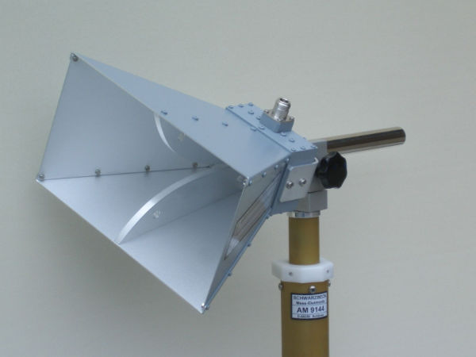

The engineer explained that today all they need to check is that the radio basically works. He expected Shrew to be able to do a conducted RF power test but this is where I screwed up… 

Have you ever seen a radio circuit board with both an chip or trace antenna and then also a coax connector footprint that’s disconnected? Or maybe simply some test points exposed on the antenna?

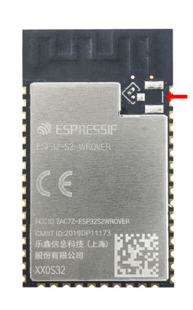

I have… but I completely forgot. That connector isn’t just for maybe an optional external antenna, that connector is required by the lab so they can actually do a conducted RF power test.

Well, it’s fine, the engineer told me that I can just desolder the chip antenna and then solder a coax cable to it with a SMA connector on the other end of the coax.

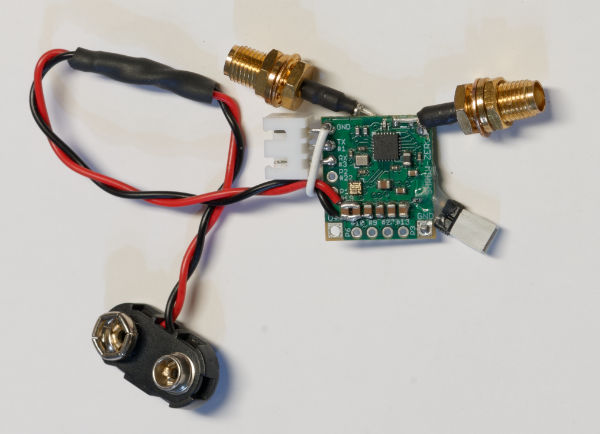

(uh, so if you want to scream at me right now, you are right, but I was in a hurry, getting another lab session in ASAP was important so that I actually know how to prep the EUT properly)

If you are reading this because you want to put your own thing through certification, this means you should have a minimum of two EUTs, one for radiated testing and another for conducted RF testing. The engineer working with me recommended having an additional backup of each. Hell, from my experience, I would have loved to have one or two EUTs just for each firmware, it would make everything so much easier.

I spent some time writing a GUI so that operating the EUTs is simple, it would make it less risky and make it easier to write instructional documents. I showed the GUI to the lab's engineer to get some feedback

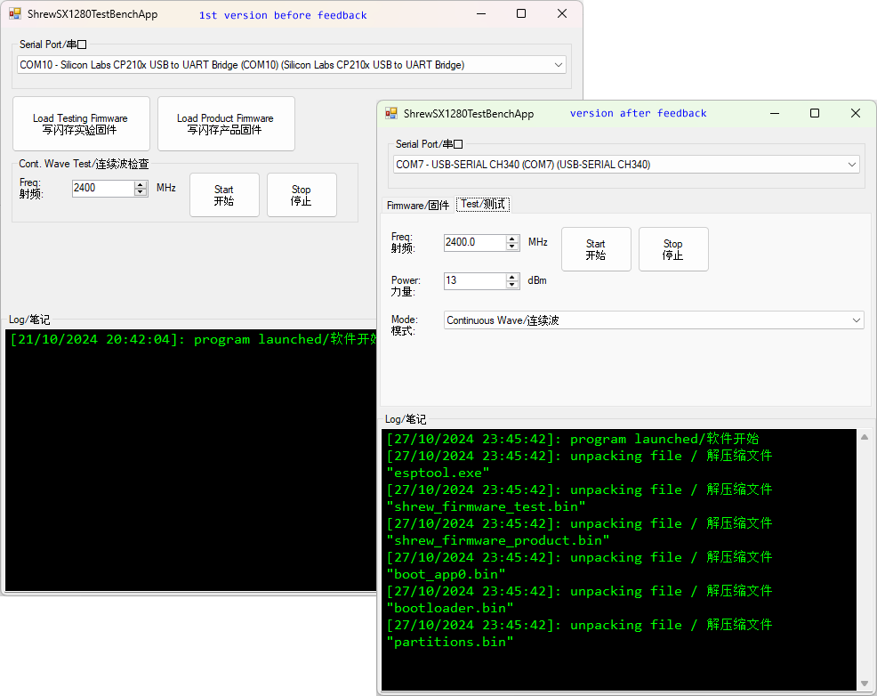

and it was explained to me that ideally, expose every single option, especially output power, even if you have a firmware-fixed output power. If your device fails a particular test, adjusting the output power might instantly make it pass.

I had a quick video call with the lab's account manager, this was actually just to walk through the items on the invoice. The next day we also met in the lab for another pre-scan. During this meet I talked with both the account manager and a group of engineers first, we discussed frequency hopping, and it was determined that if it does do frequency hopping, then it can be reclasiffied as FHSS instead of DTS, and it would not incur any additional testing costs, which was the most important point here.

Shrew is usually a receiver, it hops frequencies but listens only, and sends off a telemetry packet every second or so. Normally this would not really be called frequency hopping. Most of the frequency hopping tests are making sure you are not hogging any frequency for too long, and obviously this infrequent telemetry packet would not even come close to violating those rules. But... Shrew is also capable of using ELRS's Airport mode, meaning if Shrew had to send back a large packet, then it would be divided into many small packets and sent following the hop pattern. If testing the frequency hopping would've costed too much money, I probably would consider disabling the Airport mode.
