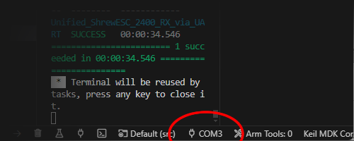

# Firmware Updating via USB

## Preparing the Circuit

The Shrew circuit has a `BOOT` pad on it, next to it is a ground pad.

To place it into bootloader mode, solder something between the boot pad and the ground pad. It's quite easy to bridge the two pads with just a single blob of solder, but an alternative is to use a thin piece of wire.

## USB to Serial Converter

You will need to have a USB-to-serial converter of some sort.

There are a lot of options. My personal preference is to get something from SparkFun Electronics

 * [SparkFun Serial Basic Breakout - CH340C and USB-C](https://www.sparkfun.com/products/15096)
 * [SparkFun Serial Basic Breakout - CH340G](https://www.sparkfun.com/products/14050) (USB-micro)
 * [SparkFun Beefy 3 - FTDI Basic Breakout](https://www.sparkfun.com/products/13746) (this one claims to handle more power on the 3.3V bus, but costs 2x as much)
 * [Amazon product link](https://www.amazon.com/dp/B07T1XR9FT) (it's a pack of 4 for about $10)

For whichever one you get, plug it in to your computer and install the appropriate driver for it.

If the voltage on the converter can be changed, make sure it's set to 3.3V

## Connections

**IMPORTANT:** make sure the boot pad is already grounded!!!

Make the connections like so

Notice that the TX pin on the converter connects to the RX pin on the Shrew. The RX pin on the converter connects to the TX pin on the Shrew.

## Flashing

If you are using the online firmware configurator tool at [https://expresslrsconfig.eleccelerator.com/](https://expresslrsconfig.eleccelerator.com/) then you should be able to click "Flash Firmware". You will be prompted to select a serial port, select the one representing your USB-to-serial converter.

If you are using PlatformIO (if you are building from source code), then get to the PlatformIO tab, select `Unified_Shrew..._via_UART` as appropriate, select the serial port at bottom of the screen, and then click `Upload`.

**IMPORTANT:** if you need to do a recovery of some sort, it might be wise to also perform a full flash erase. For PlatformIO, the option for `Erase Flash` is tucked under the `Platform` option group.

**IMPORTANT:** Do not use the official ExpressLRS configurator. It does not provide the customized firmware version that Shrew requires.

## Remove the BOOT Jumper

After you finished flashing, remember to remove the solder jumper you put on the `BOOT` pad. Or else the Shrew will never power up into normal mode, it'll be stuck in bootloader mode until you remove that jumper.
