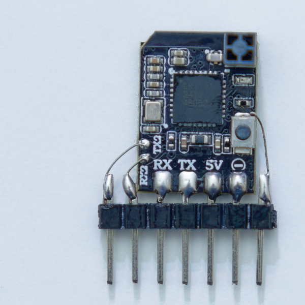
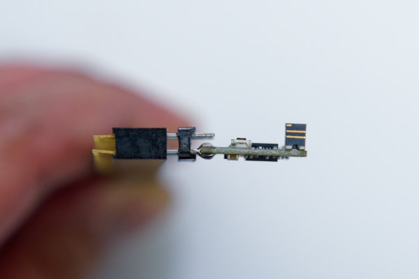

# RadioMaster XR2 Receiver PWM Mod

The RadioMaster XR2 is a nano-sized ExpressLRS receiver. It typically only communicates to a drone flight-controller via two UART pins. Modifying this receiver can allow it to output up to 5 PWM (or even Dshot) signals, which makes it useful for robotics applications.

This is the evolution of the same PWM modification done to many previous generation ExpressLRS nano-sized receivers.

## User Manual

If you have already done the modification, then please read the user manual linked here TODO.

Here's the pin-out for your convenience:

## Method 1: single row of pins

Get a strip of plain male header pins with 0.1" spacing, 7 pins long. Cut and bend the pins according to the photo below:

Solder the header pins to the XR2. Remember to start with just one pin, then adjust it until it is straight, before soldering the four short pins to the castellated pads.

It helps if you stick the male pins into some female headers to keep all the pins straight during soldering. This prevents the pins from moving even if the heat melts the plastic holding the pins.

Get some thin wire, 30 AWG or 32 AWG solid (not stranded) wire. If you don't have this, maybe take apart some stranded wire and grab individual strands out of it. These wires will only carry a small signal so they don't have to be thick.

Solder one piece of wire to the top solder-pad of the button. The other end of this wire needs to be soldered to the pin on the far right side.

On the left side of the XR2, there are two tiny pads labelled RX2 and TX2. Solder short lengths of wire from those pads to the header pins on the left.

You are half done. Clean the entire circuit using 99% rubbing alcohol and an antistatic toothbrush. Take a break.

## Method 2: two rows of pins

This method makes the whole receiver narrower. Start by getting a 4x2 chunk of male header pins (0.1" pin spacing). Modify it according to this photo:

Then, similar to the previous method, solder the shorter header pins to the castellated pads on the XR2. The longer pins should be on the higher side.

Make sure there are no unintentional shorts/bridges to the upper row.

Use thin wire (mentioned above) to connect the top solder pad of the button to the upper header pin on the right side.

And then connect the RX2 and TX2 pads to the upper header pins on the left side.

Clean the entire circuit using 99% rubbing alcohol and an antistatic toothbrush. Take a break.

## Additional Soldering Notes:

If the wire for the button is too difficult, simply don't attempt it. You will end up with 4 channels instead of 5.

## Protecting Everything

Since we expect this receiver to take a beating, we need to toughen it up because it has a very tall antenna and now some thin wires. Use epoxy to secure the antenna and the thin wires. Then protect everything using heat-shrink tubing.

## Firmware Modification

The real evolution here is that RadioMaster made the XR2 receiver with a more advanced microcontroller, the ESP32-C3. Previous generations of receivers used the ESP8. The ESP32-C3 has more internal features that allows it to send Dshot signals. It can also establish serial communications on any pin, not just the ones labelled as RX and TX.

Dshot is a digital signal that is better than PWM. Since it is digital, it is more resilliant against electrical noise, making it work better with higher voltage power systems.

Since it can communicate using serial on any pin, it means that it can reconfigure AM32 speed controllers (ESC) connected to it, not just one, but as many as you want.

These features are not in the official ExpressLRS firmware yet (today is Feburary of 2025)! Currently Dshot only works with BLHeli32 and not AM32. The AM32 configurator is also not a part of the ExpressLRS project. I have written my own fork of the ExpressLRS firmware that makes Dshot work with AM32 and also adds the AM32 configurator. I have also added a ton of other features specifically tailored towards combat robotics.

Please download the firmware here: TODO

To update, TODO

WARNING: There is bad news, if you own a transmitter that does not support Gemini, then the XR2 is not able to achieve 1000 Hz packet rate, the highest rate will be 500 Hz. If you have your transmitter set to use 1000 Hz, which is the default, then the XR2 will fail to connect.

WARNING: the bind button on the XR2 will not function as a bind button after this mod, so you must bind it with a bind phrase.

List of additiona features that's not in official ExpressLRS release:

 * Dshot works with AM32 and also 3D-Dshot, required for drive motor ESCs that are bidirectional
 * AM32 configurator
 * "Administered" binding mode, prevents accidental loss of binding due to power failure
 * Ability to lock the packet rate to a single frequency, which speeds up the time it takes to reconnect if power is lost
 * Copy settings from one receiver to another
 * Easy for developers to add new features
