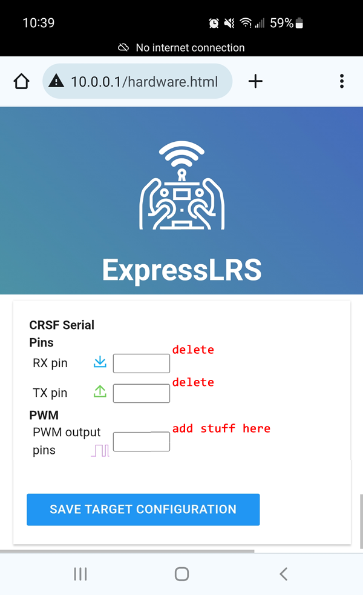
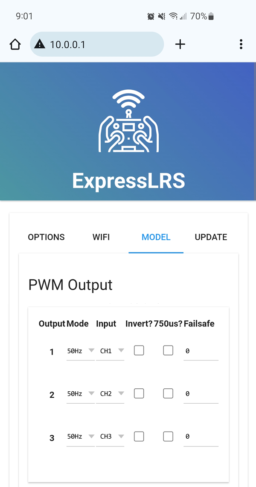
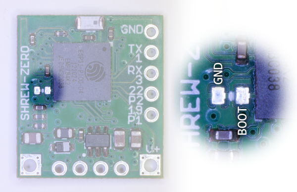
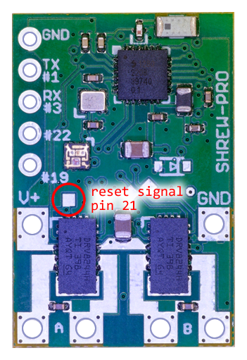
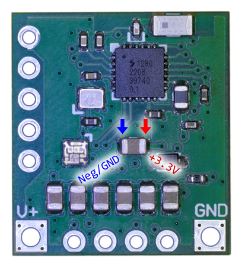

# Assigning PWM to Serial Pins

Shrew comes with serial RX and TX pins assigned to work as a CRSF port by default. These pins can be reassigned to be more PWM or Dshot pins.

There are two ways of doing this, the easiest way is to edit the hardware configuration through the Wi-Fi interface. Activate Wi-Fi mode (see your specific user manual), connect to it, and then visit the page at `http://10.0.0.1/hardware.html`

On this page, you'll see pin function assignments that can be edited with a text-box. Find the `RX pin` and `TX pin` text-boxes, and delete their contents, make sure they are blank. Then, find the text-box for `PWM output pins`, and add the numbers `, 1, 3` to the list.

Save your configuration, and then reboot Shrew completely.

When Shrew powers up again, activate Wi-Fi mode again, connect to it, and then visit the main page at `http://10.0.0.1/`. Now is the time to make sure the PWM channels are configured correctly.

Make sure to save at the end.

## The Other Method

Read the [development guide](Development-Guide) to see how to edit the hardware JSON files, which will become a part of a new firmware file if you rebuild the firmware. The entries in the JSON file for `serial_rx` and `serial_tx` must be blank, and then the pins `, 1, 3` must be added to the `pwm_outputs` array.

## Other Pins

The bootloader mode activation pin is pin 0, and it actually can be used as an output pin.

However you must be careful that whatever you connect doesn't cause the bootloader mode to be activated unintentionally. This means, whatever is connected to this pin must be either pulled-up or floating (aka high-Z or high-impedance).

On a Shrew-Pro, there is a pad to access the reset signal for the SX1280 and DRV8244.

This is pin number 21. You cannot modify this pin's function but you can take advantage of its reset pulse. It will always pulse a low signal for exactly 10 microseconds when the ESP32 is initializing.

## 3.3V Power

You can obtain a source of 3.3V power by soldering to this capacitor:

(this capacitor exists on all variations of Shrew)

The power supply is not very powerful, the rating of the voltage regulator is about 600mA, you should assume that Shrew already uses about 100mA during normal operation, and 250mA during Wi-Fi mode.

You can use this to implement a small IMU sensor as an example.
