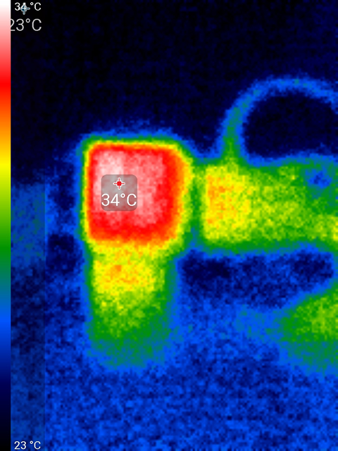

# Revision Zero

The first batch of prototypes were made around June of 2024. This batch is special and different from subsequent batches.

All PCBs are made without castellated edge holes to save cost. This makes the PCB a bit bigger than intended. To join the receiver and motor driver PCBs together, the edge of the PCB can be sanded down first to create castellated edge holes that are soldered together.

The receiver PCB half is manufactured as a standard 4 layer PCB with 1 oz copper. The mini motor driver PCB is made with a 2 layer PCB with 1 oz copper. The mega motor driver is made with a 2 layer PCB with 2 oz copper. Any future revisions with the two halves integrated will need to use a 4 layer PCB.

I forgot to put some silkscreen text on the PCBs. Please refer to diagram to avoid any wiring mistakes.

The footprints being used for the 0402 components are a bit larger than what the PCB manufacture prefers, but this might help me when I am hand soldering or doing repair work. Future revisions will have a smaller footprint for the 0402 components.

## Botched Signals

The receiver portion has a pin assignment error. I had JLCPCB put in the ESP32-Pico-D4, the first generation of the Pico, but on that particular chip, the pins for GPIO16 and GPIO17, which are wired for the motor drivers, cannot be used at all. So to fix this, I've used some bodge-wiring to connect those to GPIO9 and GPIO10 instead (these were supposed to be auxiliary servo signals).

This means revision-zero loses two pins for auxiliary servos, and probably cannot do things with I2C or CAN bus. The serial TX and serial RX pins can in theory be used for other purposes other than serial port though.

The Shrew-Mega motor driver PCB is missing the sleep signal. The design tied the sleep signal to 3.3V but this is apparently never going to work, the DRV8244 chip requires a very brief low pulse on the sleep signal before it works. So to fix this with a bodge-wire, the voltage regulator's output leg is bent and connected directly to the Shrew-RX's GPIO4 (this used to be the battery measuring ADC pin). The existing 3.3V signal is rerouted to the Shrew-RX's RX pin.

## Mini Motor Driver

The components for revision-zero may differ from future cost optimized revisions.

The voltage regulator is a [DS8242-33A3L](https://jlcpcb.com/partdetail/Dstech-DS824233A3L/C5884130), which is rated for up to 23V input continuously, 28V absolute maximum. It claims to output 500mA continuously when not considering thermal derating. It does feature thermal limiting. Dropout voltage is 0.5V.

The input capacitors on this circuit are four [C440198](https://jlcpcb.com/partdetail/439567-GRM21BR61H106KE43L/C440198), 10uF 50V X5R +/-10% ceramic capacitors. Future revisions may aim to use capacitors that have higher capacitance.

## Mega Motor Driver

The revision-zero mega variant motor driver is completely hand soldered.

The voltage regulator on it is a [MIC5239-3.3YS](https://www.digikey.com/en/products/detail/microchip-technology/MIC5239-3-3YS-TR/1030750). It is rated for a 30V input, 32V absolute maximum input. It claims to output 500mA continuously when not considering thermal derating. It does feature thermal limiting. Dropout voltage is 0.35V.

The input capacitors on this circuit are 7x [C2012X5R1V226M125AC](https://www.digikey.com/en/products/detail/tdk-corporation/C2012X5R1V226M125AC/3951664), 22uF 35V X5R ceramic capacitors. These are somewhat expensive and may not be used in future cost optimized revisions.

## Initial Thermal Tests

Test condition:

 * PCBs are detached
 * Input voltage 17.2V
 * Room temperature set to 75°F, which is 24°C
 * Receiver is connected to Transmitter, 100Hz packet rate, 10mW telemetry, 1:32 telemetry ratio. This is roughly 120mA of load on the 3.3V power

Voltage Regulator `MIC5239-3.3YS`

Voltage Regulator `DS8242-33A3L`

ESP32-Pico-D4

SX1280

 * Same setup as above
 * Receiver is connected to Transmitter, 100Hz packet rate, 10mW telemetry, 1:128 telemetry ratio. This is roughly 80mA of load on the 3.3V power

Voltage Regulator `MIC5239-3.3YS`

Voltage Regulator `DS8242-33A3L`

# Oscillator Quality

The oscillator is a TCXO, temperature compensated crystal oscillator. This type of oscillator should ensure that the RF performance is superb under all temperature conditions. The particular part being used is a `Seiko Epson X1G0054410320`.

ExpressLRS has a test mode that generates a continuous wave at 2440 MHz and you are supposed to measure it to see how good your oscillator is. The lower the deviation from 2440 MHz, the better. More information about this test: https://www.expresslrs.org/hardware/crystal-frequency-error/

It's measuring a 2440.006 MHz in the above screen shot, which is about as good as it gets.
