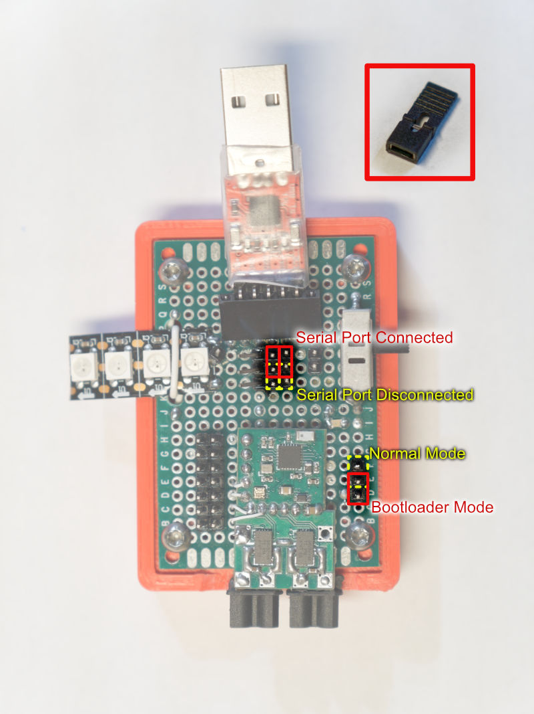

# Shrew Dev-Kit for Annihilation Robotics

This is a "developer's kit" built using an old retired version of Shrew. It allows for quick repeated updating+testing of Shrew firmware, without having to mess with an actual robot. The serial port is available for updating and debugging. The power comes from the USB port. There are pins that can be connected to external devices.

# Overview

# Pins

Each row has two pins, the two are both connected. This can make it easier to connect both an external device and a logic analyzer.

# Shunt Jumpers

Use the included shunt-jumpers to select bootloader mode vs normal mode.

Use the included shunt-jumpers to decide if the USB serial port should be connected or disconnected. If you wish to use the serial port pins for other devices, then move the jumper to the "disconnected"  position so that the USB serial port does not interfer with the external device.

(hint: the yellow positions are meant for you to store the shunt-jumpers so that you don't lose them)

# Using the LED Strip

There is a data pin for the LED strip, use a female-to-female wire to connect that data pin to a GPIO pin on the big main connector. This allows you to pick and choose the pin freely.

# USB Serial port

The connector for the USB serial port is only designed for a particular design I found on Amazon. Please don't lose it. If it needs to be replaced, use this [Amazon product link](https://www.amazon.com/gp/product/B07T1XR9FT/)
