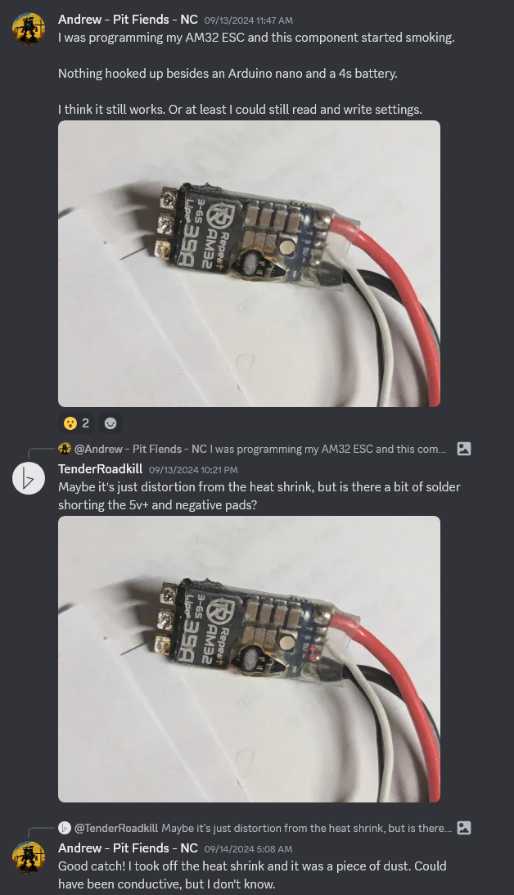
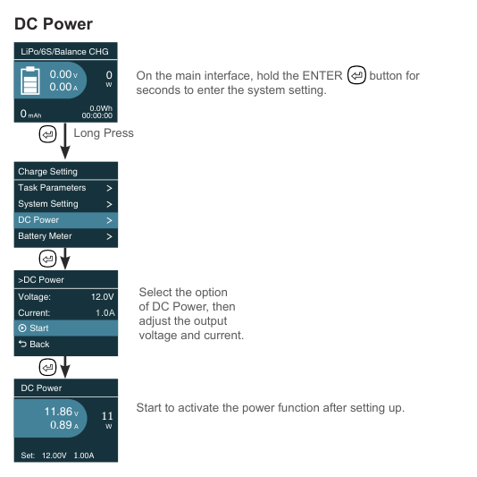

# Testing With Smoke Stoppers

In the RC hobby (drones, robotics, etc), a "smoke stopper" is basically a fuse. It is inserted between a power source (battery) and the circuit being tested. If the circuit has a problem that causes an unusually large electrical current draw, the fuse will "blow", disconnecting the power, and hopefully preventing "smoke" (damage to circuit or power source).

This article will discuss using these smoke stoppers in the combat robotics hobby. It is my personal opinion that they are an essential tool for combat robotics competitors. I use one all the time. Every single time after I work on my robot's circuit, or after every robot fight, I use a smoke stopper during the next power-on test.

For example, it would've prevented this kind of accident:

# What Kind of Protection

These smoke stoppers typically only protect against unexpectedly high electrical current. They do NOT protect against high voltages. They also do NOT protect against reverse polarity.

Most importantly, they will prevent a battery from exploding from unexpectedly high discharge currents. They can prevent voltage conversion circuitry (voltage regulators and such) from being damaged from high currents. They can prevent MOSFETs from being damaged from high currents.

But again, I need to emphasize: they cannot prevent damage from high voltages or from reversed polarity.

If you do end up plugging in a battery backwards, or somehow connected a red wire to black wire, it is still likely that it results in a high current and the smoke stopper will trip, but it is not guaranteed. For example, a polarized capacitor in your circuit can still "pop" from such a mistake. But the important thing is that the battery will not explode if you make this mistake.
 
# What Kind of Smoke Stopper

There is literally only one smoke stopper that I can recommend: the ViFly Short Saver 2 Smoke Stopper

 * [Amazon Link](https://www.amazon.com/VIFLY-ShortSaver-Electronic-Short-Circuit-Available/dp/B088TVVNVM/ref=sr_1_4)
 * [Get FPV Store](https://www.getfpv.com/vifly-shortsaver-2-smart-smoke-stopper-xt60-xt30.html)
 * [Pyrodrone Store](https://pyrodrone.com/products/vifly-short-saver-2)
 * [Race Day Quads Store](https://www.racedayquads.com/products/vifly-short-saver-2-smoke-stopper-xt30-xt60)

This product is superior to all of its competitors for some very critical reasons. It is the only one that's actually an active electrical current sensing device, it is actually not a traditional fuse. All of the other similar products are simple self-resetting fuses.

The problem with fuses:

First, fuses use temperature to "trip", meaning they respond slower. Instead of using a fuse, the ViFly brand uses an actual current sensor, which responds much faster, in fact, you can even configure how fast it responds.

Second, fuses that self-reset have a leakage current, meaning they don't fully protect your circuit even after they trip. These self-resetting fuses are a type of temperature dependant resistor, they increase in resistance when they get hot, which is how they stop current from flowing when they get hot. After the fuse trips, it will then cool down, and the resistance will go a bit lower, letting more current through. This could start to cause damage to your circuit. Nobody seems to make a smoke stopper with a traditional fast-blow fuse, which would require a replacement every time it blows.

The ViFly brand is not a fuse, it's more like a switch that's controlled intelligently by a current sensor, so it doesn't have this problem, once it "blows", it won't leak. To reset it, you simply press a button twice.

For $12, I hope you listen to my advice here. I know it's weird for me to praise one particular product, but it is my opinion that these advantages are actually important for true effectiveness.

There are many power supplies with current limiting that are very useful for testing robots too, but you still need to be careful, as a "current limiting" feature that delivers a constant current has the same problem as a fuse that leaks current. You want your power supply to go off and stay off until the problem is resolved.

# How to Use a Smoke Stopper

Connecting a smoke stopper is easy, it comes with a battery input connector and another output connector, usually XT30 or XT60 or both. You plug in a battery to the input, and the output connects to where your battery was supposed to go on your robot. The ViFly smoke stopper also has an ON button you need to press.

It is important to know that all of these smoke stoppers are rated or configured for only 1A of current, I think the ViFly one can be configured for 1A or 2A. This means it is not supposed to let you run motors. So basically, you are just checking things like:

 * battery did not explode
 * receiver connects to transmitter
 * lights on the ESC(s) turn on and blink

I know this won't test the motors, but your next test will be testing the motors without a smoke stopper. Using the smoke stopper was to make sure that it is safe to proceed to the next test.

# Adding USB-C to a Smoke Stopper

If you don't want to use a battery during this test, I will teach you how to power your smoke stopper with a USB-C cable instead. This is convenient because USB-C powered soldering irons and USB-C powered battery chargers are extremely popular already with the robot combat community.

You need to buy something called a "USB-C voltage trigger", which is something that tells (triggers) a USB-C power adapter to supply a higher voltage. Typically they have selectable voltages but pre-configured for 12V, which is about the same voltage as a 3S battery pack.

 * [Amazon Link, adjustable, 12V default](https://www.amazon.com/Trigger-Charging-Adjustable-Voltage-Board/dp/B0D54584JB/ref=sr_1_15)
 * [Amazon Link, adjustable, 20V default](https://www.amazon.com/Trigger-Adjustable-Voltage-Module-Default/dp/B0B688SKNK/ref=sr_1_5)
 * [Amazon Link, 12V fixed](https://www.amazon.com/AITRIP-Voltage-Trigger-Module-Type-C/dp/B09M3SQSXL/ref=sr_1_3)
 * [Amazon Link, 12V fixed](https://www.amazon.com/Trigger-Adjustable-Voltage-Module-Default/dp/B0BRNGKRDJ/ref=sr_1_5)

Get one, solder a XT30 or XT60 connector on it. Bada-bing bada-boom.

Your USB-C power adapter is probably capable of outputting 2A of current at 12A, that's only about 24W. Those USB-C soldering irons use something like 65W. Remember that the smoke stopper is only 1A or 2A anyways, so it's perfectly fine to use a USB-C power adapter for these tests.

IMPORTANT: The USB-C power adapter must be capable of USB-PD and capable of 30W or more. If you can run a soldering iron with it, then it should work.

# Using a Battery Charger as a Testing Power Supply

I have a SkyRC B6neo, it's a compact battery charger powered by USB-C.

It has an extra function, you can use it to act as a adjustable voltage power supply, with a specified current limit. Here is how to access this feature (screen shot from user manual):

If you are unsure about the settings, I suggest you use 12V and 1.0A as the setting, which approximates a 3S battery. The current should not be too high, so 1.0A is a nice setting.

You will need to make adapter cables to use the charger this way. The end that goes into the charger must be a XT-60 female, and the other end should be the same as the connector that's already on your battery.

If your circuit malfunctions and draws an unexpectedly large electrical current, the B6neo will show an error message and shutdown

but it might also simply shutdown without showing an error message at all. It depends on how bad the failure really was. A full short circuit will cause a shutdown without an error message, probably because the power supply upstream from the B6neo has shutdown.

**IMPORTANT: I tried both the HOTA brand and the ToolKitRC brand chargers, they should not be used as a smoke stopper**. They have constant current implementations with (what appears to be) a PID loop modulating the voltage to keep the current constantly at whatever you've set. This means it will still attempt to leak power into a circuit that is failing, it will not stop the power completely, it will not show any error messages. **Although this does actually mean they are technically better chargers than the SkyRC one. In fact, the HOTA has both constant current and constant power if you need it.**
